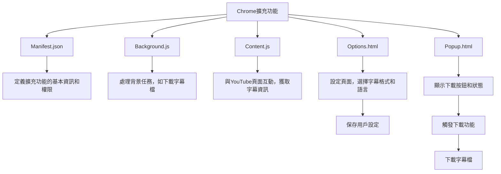

# Chrome擴充功能開發計劃

## 功能概述
開發一個Chrome擴充功能，可以一鍵下載YouTube影片的字幕檔，並在瀏覽器右邊顯示圖案。

## 主要功能
1. 下載字幕檔，支持多種格式（如txt, srt等）
2. 讓使用者選擇字幕語言
3. 顯示紅色圖示，與YouTube的logo一致

## 文件結構

## 開發步驟
1. 建立manifest.json文件，定義擴充功能的基本資訊和所需權限。
2. 建立background.js文件，處理背景任務，如下載字幕檔。
3. 建立content.js文件，與YouTube頁面互動，獲取字幕資訊。
4. 建立popup.html文件，顯示下載按鈕和狀態。
5. 建立options.html文件，讓使用者選擇字幕格式和語言，並保存設定。
6. 設計紅色圖示，與YouTube的logo一致。